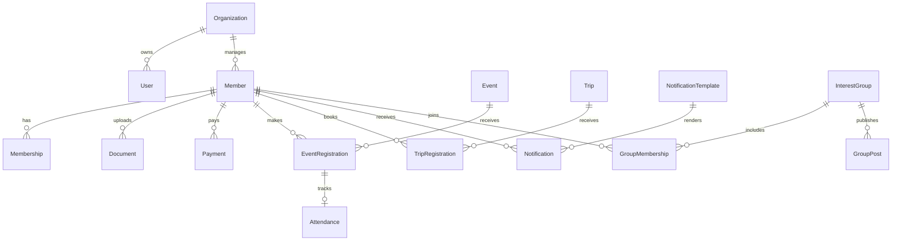

# SeniorConnect

SeniorConnect is a production-ready starter platform for managing senior citizen communities, memberships, events, travel programs, engagement, documents, payments, and analytics.

## Stack

- Backend: FastAPI, SQLAlchemy, Alembic, SQLite (PostgreSQL-ready)
- Frontend: React, Material UI, React Query, React Router
- Auth: JWT authentication with role-based access control
- Deployment: Docker Compose with Nginx reverse proxy

## Quick Start

```bash
cp backend/.env.example backend/.env
docker compose up --build
```

- Frontend: http://localhost
- API: http://localhost/api
- Swagger: http://localhost/api/docs

Default seeded administrator:

- Email: `admin@seniorconnect.local`
- Password: `Admin123!`


### One-click Windows/offline install

For a club computer that needs an offline/on-premise setup, build a Windows package that includes a PyInstaller FastAPI executable and the compiled frontend:

```powershell
powershell -ExecutionPolicy Bypass -File installer\windows\build_installer.ps1
```

The build creates `dist\SeniorConnect-Windows`. Copy that folder to the Windows PC and double-click `Start-SeniorConnect.bat`; it runs `SeniorConnectServer.exe` in a visible server window, opens the browser, writes startup failures to `seniorconnect-error.log`, and stores SQLite data/uploads next to the executable for easy backup.

The backend executable is created from `backend/start_server.py` using PyInstaller, equivalent to:

```bash
pip install pyinstaller
pyinstaller --onefile --paths backend --collect-submodules app --collect-submodules passlib.handlers --collect-submodules passlib.crypto --hidden-import passlib.handlers.bcrypt --hidden-import bcrypt backend/start_server.py
```

## Local Backend

```bash
cd backend
python -m venv .venv
source .venv/bin/activate
pip install -r requirements.txt
alembic upgrade head
python -m app.seed
uvicorn app.main:app --reload
```

## Local Frontend

```bash
cd frontend
npm install
npm run dev
```

## Architecture

The backend follows a clean layered structure:

- `api/`: HTTP routes and dependency boundaries
- `core/`: settings, security, RBAC
- `models/`: SQLAlchemy persistence models
- `schemas/`: Pydantic DTOs
- `repositories/`: database access abstractions
- `services/`: business workflows

The data model is multi-tenant ready through `organization_id` fields on operational records. The MVP seeds a single organization.

## ER Diagram



## Security

- Passwords are hashed with bcrypt.
- JWT bearer tokens protect private APIs.
- RBAC dependencies restrict privileged modules.
- Upload metadata includes MIME type, size, versions, and expiry dates.
- Audit logs capture actor, action, entity, and timestamp.

## Reports

Report endpoints support CSV downloads for members, memberships, events, and travel. PDF and Excel generation can be added behind the same service interface.

## Implemented MVP Workflows

- Sign in with the seeded administrator and use protected navigation across all modules.
- Create, search, update, and delete members through REST APIs; create members from the frontend.
- Manage membership records and renewals with status tracking.
- Create events, register members, and record attendance check-ins.
- Create trips and register members with capacity-aware waitlisting.
- Record membership, event, and travel payments with generated receipt numbers.
- Upload and list document metadata with file type and size enforcement.
- Publish announcements, manage interest groups, and queue notifications.
- Download CSV reports for members, events, payments, and trips.

## API Modules

Swagger documentation is generated automatically by FastAPI at `/api/docs`. The API is organized with tags for Authentication, Dashboard, Members, Memberships, Events, Travel, Payments, Documents, Community, Notifications, and Reports.

## Frontend Pages

The React application now provides usable pages for every MVP module:

- Dashboard with KPI cards, charts, and quick-action navigation.
- Members with a full create form covering contact, address, emergency, and health fields.
- Memberships with membership type/status tracking and renewal-ready data.
- Events with event creation, member registration, and manual check-in controls.
- Travel with trip creation and traveler registration controls.
- Community with announcement and interest-group creation.
- Notifications with email/SMS/WhatsApp-ready message queue forms.
- Documents with browser-based uploads for supported member document types.
- Payments with receipt-backed payment entry.
- Reports with CSV download cards.
